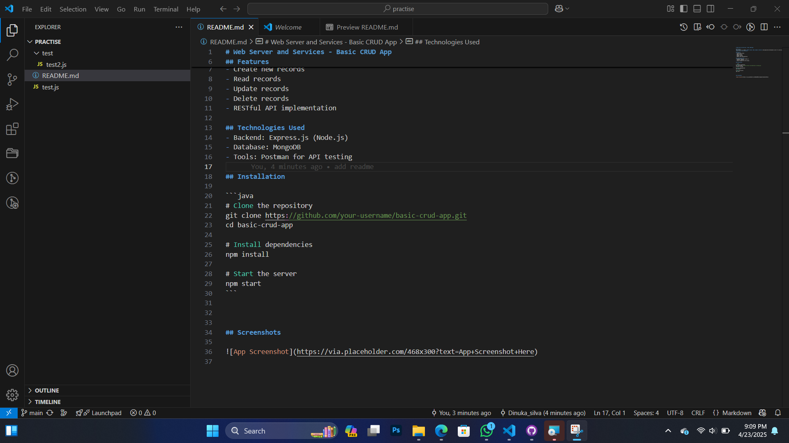

# Web Server and Services - Basic CRUD App

## Overview
This project is a simple **CRUD (Create, Read, Update, Delete)** web application developed as part of a practical session on **Web Servers and Services**.

## Features
- Create new records
- Read records
- Update records
- Delete records
- RESTful API implementation

## Technologies Used
- Backend: Express.js (Node.js)
- Database: MongoDB
- Tools: Postman for API testing

## Installation

```java
# Clone the repository
git clone https://github.com/your-username/basic-crud-app.git
cd basic-crud-app

# Install dependencies
npm install

# Start the server
npm start
```


## Screenshots


